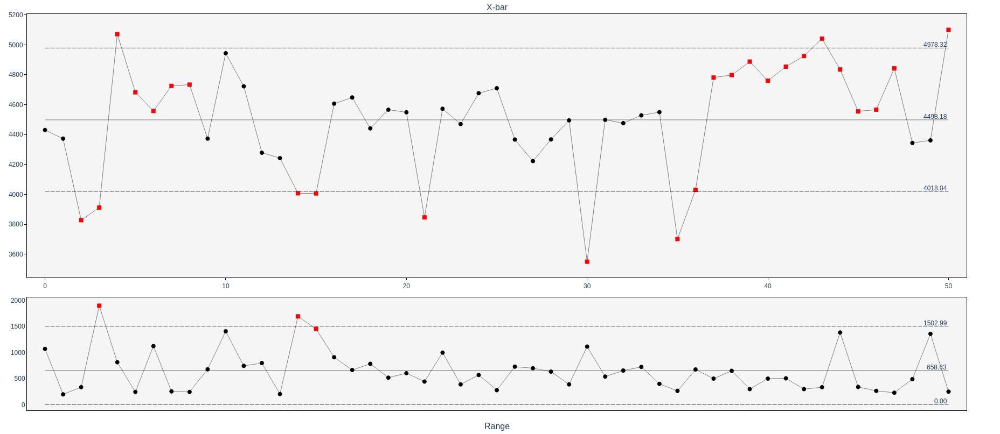

# pyControlCharts

[](https://github.com/suanto/pycontrolcharts/actions/workflows/tests.yml)

A Python library for Statistical Process Control (SPC) charts (also known as control charts or Shewhart charts). Build machine-readable chart data with pandas; optionally plot interactively with Plotly.


*XbarR chart with variation chart plotted.*


## Features

- **All major chart types**. Variables (XmR, X-bar/R, X-bar/S) and attributes (p, np, c, u); one consistent API and output schema for all.
- **Run tests**. Out-of-control detection (Nelson rules, configurable); violations include type codes and human-readable descriptions.
- **Multi-phase and spec limits**. Per-phase control limits; specification limits as single value, list, or DataFrame column.
- **Variable subgroups**. X-bar/R and X-bar/S support fixed or variable subgroup sizes.
- **Custom limits**. Apply run tests to pre-computed limits (e.g. from a baseline).
- **Simple API**. One call per chart; optional built-in plotting for all types.
- **Export**. CSV, Excel, or JSON for pipelines, reports, or downstream tools.
- **Pandas integration**. Every chart returns a single DataFrame with limits, violations, phases, and optional spec limits; same schema for all chart types.
- **Type-safe**. Full type hints; Python 3.10+.
- **Well-tested**. Test suite with validated examples from Wheeler's "Understanding Statistical Process Control".

## Supported chart types

- **Variables (continuous data):** XmR (Individuals and Moving Range), X-bar/R, X-bar/S.
- **Attributes (discrete/count data):** p-chart, np-chart, c-chart, u-chart.

See [User guide](USER_GUIDE.md) for details.

## Why pycontrolcharts?

- **Machine-readable charts**. Fixed schema for all chart types: limits, sigma lines, violations, phases, spec limits. Export to CSV, Excel, or JSON and plug into pipelines, tools, LLM or AI agents.
- **Optional Plotly**. When you need a chart, use built-in plotting for any chart type. Interactive HTML, multi-phase limits, violation markers.
- **Few dependencies**. Core install is pandas only. Add the plotly extra only if you want built-in plotting.
- **Easy to integrate with AI**. Structured DataFrame and JSON export with clear violation types and descriptions. Fits naturally into agent workflows and tool use.
- **Industry-aligned**. Nelson run tests by default; configurable (e.g. Western Electric). Formulas and constants from Wheeler and Montgomery.
- **Validated**. Test suite aligned with Wheeler's "Understanding Statistical Process Control"; same limits and behaviour you can verify from the book.


## Installation

```bash
pip install pycontrolcharts
```

For Plotly plotting:

```bash
pip install pycontrolcharts[plotly]
```

## Quick start

### 1. Compute chart data (no plotting)

```python
from pycontrolcharts import calc_xmr

data = [39, 41, 41, 41, 43, 44, 41, 42, 40, 41, 44, 40]
df = calc_xmr(data)

print(f"Center line: {df['center_line'].iloc[0]:.2f}, UCL: {df['ucl'].iloc[0]:.2f}")
violations = df[df['violations'].apply(len) > 0]
print(f"Out-of-control points: {len(violations)}")
```

Example output (subset of columns only; see [API reference](API.md) for full schema):

```
   point_id  value  center_line     ucl     lcl violations ...
0         0     39         41.5  44.16  38.84         []
1         1     41         41.5  44.16  38.84         []
2         2     41         41.5  44.16  38.84         []
```

### 2. Plot with Plotly (optional)

```python
from pycontrolcharts import calc_xmr, plot_control_chart, ChartType

df = calc_xmr([39, 41, 41, 41, 43, 44])
fig = plot_control_chart(df, ChartType.XMR, title="Pressure")
fig.show()
# or: fig.write_html("xmr.html")
```

### 3. Export chart to JSON

The chart DataFrame can be exported to JSON for pipelines, APIs, or AI tools:

```python
from pycontrolcharts import calc_xmr

df = calc_xmr([39, 41, 41, 41, 43, 44])
df.to_json("chart.json", orient="records", indent=2, date_format="iso")
# Or get a string: json_str = df.to_json(orient="records")
```

Example output (excerpt of `chart.json`):

```json
[
  {
    "point_id": 0,
    "value": 39,
    "label": 1,
    "center_line": 41.5,
    "ucl": 44.16,
    "lcl": 38.84,
    "spec_upper": null,
    "spec_lower": null,
    "phase": null,
    "violations": [],
    "variation": null,
    "variation_ucl": 3.268,
    "variation_cl": 1.0,
    "variation_lcl": 0.0,
    "variation_violations": []
  },
  {
    "point_id": 1,
    "value": 41,
    "label": 2,
    "center_line": 41.5,
    "ucl": 44.16,
    "lcl": 38.84,
    "violations": [],
    "variation": 2.0,
    ...
  }
]
```

Each row in the JSON is one point (e.g. one measurement for XmR). See [API reference](API.md) for the full output schema.

## Documentation

- [User guide](USER_GUIDE.md). Getting started, input/output, run tests, spec limits, multi-phase, plotting, export.
- [API reference](API.md). Output schema, chart functions, plotting options.
- [Changelog](CHANGELOG.md)
- [Contributing](CONTRIBUTING.md). Dev setup, tests, releasing. Repository layout and dev scripts: see [Project structure](CONTRIBUTING.md#project-structure) and [Scripts](CONTRIBUTING.md#scripts).
- [Publishing](PUBLISHING.md). Building, PyPI and GitHub setup, release testing, fixing broken releases.

## License

MIT. Author: Antti Suanto.
