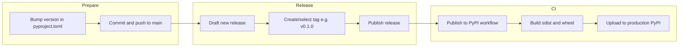

# GitHub process for creating a new release, tagging, and releasing

This describes the flow documented in [PUBLISHING.md](PUBLISHING.md) and implemented by [.github/workflows/publish.yml](.github/workflows/publish.yml).

---

## Release model

- **Single head:** All production code lives on the default branch (e.g. `main`). There is no separate release branch.
- **Trigger for PyPI:** Publishing to **production PyPI** is triggered by **publishing a GitHub Release**, not by pushing a tag alone. The workflow listens for `release` with `types: [published]`.

---

## Step-by-step: new release and publish to PyPI

1. **Bump version**
   - Update `version` in [pyproject.toml](pyproject.toml) (e.g. `0.1.0` → `0.2.0`).
   - Commit and push to `main`.

2. **Create the GitHub Release (this is the "tag + release")**
   - In the repo: **Releases** → **Draft a new release**.
   - Either:
     - **Create a new tag** from the UI (e.g. `v0.2.0`) on `main`, or
     - Choose an **existing tag** if you already pushed one (e.g. `git tag v0.2.0 && git push origin v0.2.0`).
   - Tag must match the version in `pyproject.toml` (e.g. tag `v0.1.0` for `version = "0.1.0"`).
   - Add release title/notes if desired.
   - Click **Publish release**.

3. **What happens next**
   - The **Publish to PyPI** workflow runs automatically on `release` → `published`.
   - It checks out the repo (at the tag/commit of the release), runs `python -m build`, then uploads to **production PyPI** (Trusted Publishing or `PYPI_API_TOKEN`).

So in this setup, **tagging and releasing are done together** by creating and publishing a GitHub Release; that single action triggers the workflow and the production publish.

---

## Optional: Test PyPI only (no production)

- **Manual run:** **Actions** → **Publish to PyPI** → **Run workflow** → check **Upload to Test PyPI** (and leave production unchecked). This uses `workflow_dispatch` and does **not** require a release or tag.
- **Automatic Test PyPI for certain tags:** PUBLISHING.md notes you could add a trigger on tag push (e.g. `v*-rc*`, `v*-test*`) and a job that uploads only to Test PyPI; that is not implemented in the current [publish.yml](.github/workflows/publish.yml).

---

## Flow summary

---

## Important details

- **Tag convention:** Use tags that match the package version, e.g. `v0.1.0` for `version = "0.1.0"`.
- **No re-upload:** PyPI does not allow overwriting a version; to fix a bad release, bump to a new version (e.g. `0.1.1`), fix, then create a new release and tag.
- **Broken release:** You can **yank** the broken version on PyPI so it is no longer chosen by default; document in release notes or [CHANGELOG.md](CHANGELOG.md).
