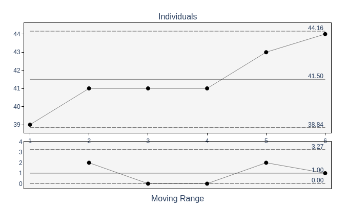
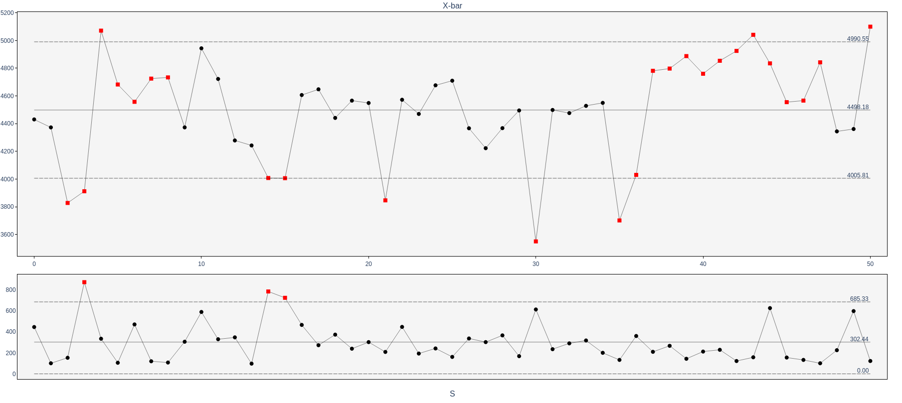
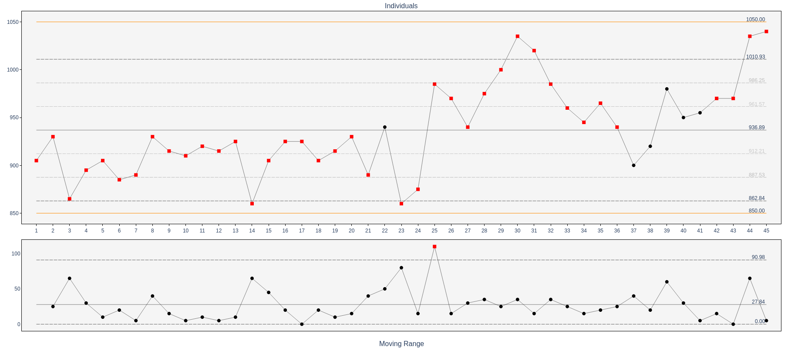
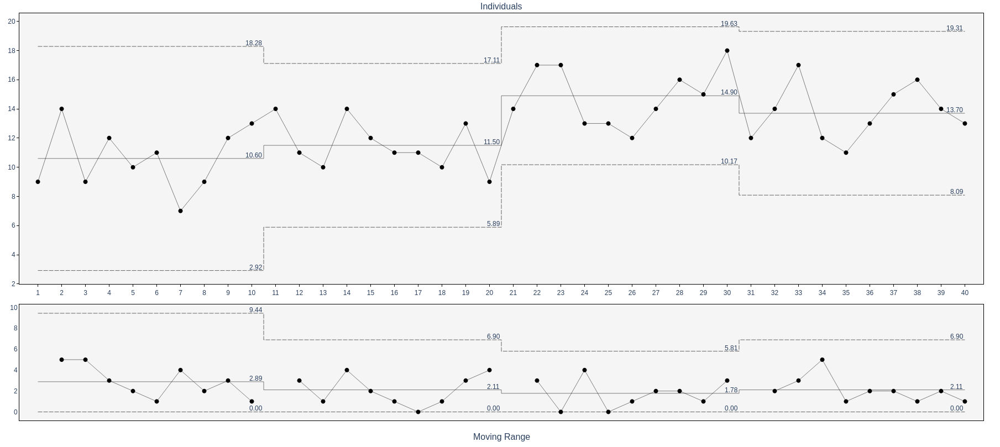

# User guide

## Getting started

For a minimal install and first chart, see [README](README.md).

### Installation

```bash
pip install pycontrolcharts
```

For Plotly plotting (optional):

```bash
pip install pycontrolcharts[plotly]
```

### First chart (compute only)

```python
from pycontrolcharts import calc_xmr

data = [39, 41, 41, 41, 43, 44, 41, 42, 40, 41, 44, 40]
df = calc_xmr(data)

print(f"Center line: {df['center_line'].iloc[0]:.2f}")
print(f"UCL: {df['ucl'].iloc[0]:.2f}")
print(f"LCL: {df['lcl'].iloc[0]:.2f}")
violations = df[df['violations'].apply(len) > 0]
print(f"Found {len(violations)} out-of-control points")
```

### First chart (with Plotly)

```python
from pycontrolcharts import calc_xmr, plot_control_chart, ChartType

df = calc_xmr([39, 41, 41, 41, 43, 44])
fig = plot_control_chart(df, ChartType.XMR, title="Pressure")
fig.show()
# or: fig.write_html("xmr.html")
```



*XmR chart with variation chart plotted.*


All chart types (XmR, X-bar/R, X-bar/S, p, np, c, u) are supported for plotting. See [Plotting with Plotly](#plotting-with-plotly) for options and details.

### Supported chart types

**Variables (continuous data):**

- **XmR** — Individuals and Moving Range (single measurements)
- **X-bar/R** — Mean and Range (rational subgroups)
- **X-bar/S** — Mean and Standard Deviation (rational subgroups)

**Attributes (discrete/count data):**

- **p-chart** — Proportion defective (variable or constant sample size)
- **np-chart** — Number defective (constant sample size)
- **c-chart** — Count of defects (constant area of opportunity)
- **u-chart** — Defects per unit (variable area of opportunity)

---

## Input and output

### DataFrame input

When your data is in a pandas DataFrame, pass column names to the `calc_*` functions:

```python
import pandas as pd
from pycontrolcharts import calc_xmr

input_df = pd.DataFrame({
    'measurement': [39, 41, 41, 41, 43, 44],
    'date': pd.date_range('2026-01-01', periods=6),
    'phase': ['baseline'] * 4 + ['improved'] * 2
})

df = calc_xmr(
    input_df,
    value_column='measurement',
    label='date',
    phase='phase'
)
print(df[['point_id', 'value', 'center_line', 'ucl', 'phase']].head())
```

- **value_column** — Column containing the measurement (required for DataFrame input).
- **label** — Column name or list for x-axis labels.
- **phase** — Column name or list for phase labels (optional; see [Multi-phase analysis](#multi-phase-analysis)).

Attribute charts use additional parameters (e.g. `value_column`, `sample_size_column` for p-chart). See [API reference](API.md) for each function.

**Quick attribute examples (list input):**

```python
# p-chart: proportion defective with constant sample size
from pycontrolcharts import calc_p
df = calc_p(data=[5, 3, 7, 4, 6], sample_size=100)

# u-chart: defects per unit with constant area of opportunity
from pycontrolcharts import calc_u
df = calc_u(data=[5, 3, 7, 4, 6], area=50)
```

### DataFrame output structure

All charts return a pandas DataFrame with standardized columns. For full column list, data types, and expected values, see the [API reference — Output DataFrame schema](API.md#output-dataframe-schema).

**Core columns (all charts):**

- **point_id** (`int`) — Sequential identifier (0, 1, 2, ...)
- **value** (`float`) — The measurement, subgroup mean, or proportion/count
- **label** (any) — X-axis label (type matches input)
- **ucl**, **sigma_2_upper**, **sigma_1_upper**, **center_line**, **sigma_1_lower**, **sigma_2_lower**, **lcl** (`float`) — Control and sigma lines
- **spec_upper**, **spec_lower** (`float`) — Specification limits; **NaN** when not provided
- **phase** (`str` or None) — Phase label; **None** when no phase was passed
- **violations** (list of dict) — Run-test violations at this point; **empty list `[]`** when none. Each item has `type` (int) and `description` (str). See [Violation type codes](#violation-type-codes) and [API — Violation item schema](API.md#violation-item-schema).

**Variables charts additional columns:**

- **variation** (`float`) — Moving range, subgroup range, or subgroup std dev
- **variation_ucl**, **variation_cl**, **variation_lcl** (`float`) — Variation chart control limits
- **variation_violations** (list of dict) — Same structure as **violations** (list of `{type`, `description}` dicts); empty list when none

**Notes:**

- **XmR**: One row per individual measurement.
- **X-bar/R and X-bar/S**: One row per subgroup (mean and variation in the same row).
- **Attribute charts**: One row per sample; no variation columns.
- **Empty input**: If you pass an empty list, Series, or DataFrame (or no subgroups for X-bar/R, X-bar/S), each `calc_*` function returns an empty DataFrame with the same column schema (no rows).

---

## Run tests (violation detection)



*XbarS chart with run tests.*


The `run_tests` parameter controls how out-of-control points are detected.

**1. `run_tests=True` (default)** — All tests enabled with Nelson defaults (Nelson rules). Customize thresholds (e.g. test2_n, test3_n) via [RunTestConfig](API.md#runtestconfig):

- **test1** — Points beyond control limits (always enabled)
- **test2** — 9 consecutive points on same side of center line
- **test3** — 6 consecutive points trending (increasing or decreasing)
- **test5** — 2 of 3 points beyond 2-sigma
- **test6** — 4 of 5 points beyond 1-sigma

**2. `run_tests=False`** — No violation detection.

**3. `run_tests=RunTestConfig(...)`** — Custom configuration:

```python
from pycontrolcharts import calc_xmr, RunTestConfig

config = RunTestConfig(
    test1=True,
    test2=True,
    test3=True,
    test5=False,
    test6=False,
    test2_n=8,   # Western Electric: 8 points instead of 9 (Nelson)
)
df = calc_xmr(data, run_tests=config)
```

### Inspecting violations

```python
df = calc_xmr(data, run_tests=True)
problems = df[df['violations'].apply(len) > 0]

for idx, row in problems.iterrows():
    print(f"Point {row['point_id']}: {row['value']}")
    for v in row['violations']:
        print(f"  - Type {v['type']}: {v['description']}")
```

### Violation type codes

The `violations` (and `variation_violations`) columns hold a list of dicts. Each dict has **`type`** (int) and **`description`** (str). The `type` values correspond to the **`RunType`** enum (see [API — RunType](API.md#runtype)). The `description` is a human-readable explanation and may include the run length N (e.g. "9 consecutive points above center line").

- **1** — Point beyond upper control limit
- **2** — Point beyond lower control limit
- **3** — N consecutive points above center line
- **4** — N consecutive points below center line
- **5** — N consecutive increasing points
- **6** — N consecutive decreasing points
- **7** — 2 of 3 points beyond +2σ
- **8** — 2 of 3 points beyond -2σ
- **9** — 4 of 5 points beyond -1σ
- **10** — 4 of 5 points beyond +1σ

### Run tests with custom limits

When you already have control limits (e.g. from a baseline or external source) and only need run-test violation detection and the standard DataFrame, use **`run_tests_with_custom_limits`** with a **`CustomLimits`** object. No limit calculation is performed; limits are taken from your input.

```python
from pycontrolcharts import run_tests_with_custom_limits, CustomLimits, RunTestConfig

limits = CustomLimits(
    center_line=10.0,
    ucl=15.0,
    lcl=5.0,
    spec_upper=20.0,   # optional, single value
    spec_lower=0.0,    # optional
)
data = [9, 11, 14, 16, 10]
df = run_tests_with_custom_limits(data, limits=limits, run_tests=RunTestConfig())
# df has same columns as calc_* output; phase is always None
```

- **Sigma lines** are optional on `CustomLimits`. When not set, output sigma columns are NaN and run tests 5 and 6 are not performed.
- **Variation chart**: set `variation_ucl`, `variation_cl`, `variation_lcl` on `CustomLimits` to include moving-range variation and its violations.
- **Empty data** returns an empty DataFrame with the same column schema.

See [API — run_tests_with_custom_limits](API.md#run_tests_with_custom_limits) and [API — CustomLimits](API.md#customlimits) for full details.

---

## Specification limits


*XmR chart with sigma lines and specification lines enabled.*

Specification limits (`spec_upper` and `spec_lower`) can be passed in three forms.

**Single float (broadcast to all points):**

```python
df = calc_xmr(data, spec_upper=50.0, spec_lower=30.0)
```

**List of floats (per-point limits):**

```python
spec_uppers = [50.0, 51.0, 52.0, 51.5, 50.5]
df = calc_xmr(data, spec_upper=spec_uppers)
```

**Column name (from DataFrame):**

```python
input_df = pd.DataFrame({
    'measurement': [39, 41, 43, 44],
    'usl': [50.0, 51.0, 52.0, 51.0],
    'lsl': [30.0, 31.0, 32.0, 31.0]
})

df = calc_xmr(
    input_df,
    value_column='measurement',
    spec_upper='usl',
    spec_lower='lsl'
)
```

Output columns `spec_upper` and `spec_lower` are present in the result when provided; plotting can show them with `show_spec_lines=True`.

---

## Multi-phase analysis


*XbarR chart with multiple phases plotted.*


You can split the process into phases (e.g. baseline vs improvement). Pass a `phase` column name or list of phase labels; control limits are computed per phase.

```python
from pycontrolcharts import calc_xmr

data = list(range(50))
phases = ['baseline'] * 20 + ['improvement'] * 30

df = calc_xmr(data, phase=phases)

by_phase = df.groupby('phase').agg({
    'value': 'mean',
    'center_line': 'first',
    'ucl': 'first',
    'lcl': 'first'
})
print(by_phase)
```

The output DataFrame has a `phase` column; limits can differ by phase. Plotting can show phase boundaries when `phase` is present.

---

## Plotting with Plotly

Install the optional Plotly extra:

```bash
pip install pycontrolcharts[plotly]
```

All chart types (XmR, X-bar/R, X-bar/S, p, np, c, u) are supported for plotting.

### Basic usage

```python
from pycontrolcharts import calc_xmr, plot_control_chart, ChartType

df = calc_xmr([39, 41, 41, 41, 43, 44])
fig = plot_control_chart(df, ChartType.XMR, title="Pressure")
fig.show()
# or
fig.write_html("xmr.html")
```

Use the appropriate `ChartType`: `XMR`, `XBAR_R`, `XBAR_S`, `P`, `NP`, `C`, `U`. You can also pass the chart type as a string (e.g. `"xmr"`, `"xbar_r"`).

### Options

- **title** — Figure title (default: chart-type-based label).
- **show_variation** — For XmR, X-bar/R, X-bar/S: also draw the variation chart below (default: True). Ignored for attribute charts (single panel).
- **show_sigma_1_lines** — Draw ±1σ lines (default: False)
- **show_sigma_2_lines** — Draw ±2σ lines (default: False)
- **show_spec_lines** — Draw spec_upper/spec_lower if present (default: False).
- **show_legend** — Show legend (default: False).
- **show_limit_labels** — Draw the numeric value at the end of each limit line (default: True).
- **limit_label_precision** — Decimal places for limit labels (default: 2).
- **force_y_axis_to_zero** — Force the main panel y-axis to include zero (default: False).
- **height**, **width** — Plot size in pixels (optional).
- **layout** — Dict merged into the figure layout (e.g. `fig.update_layout(**layout)`).

See the [API reference — plot_control_chart](API.md#plot_control_chart) for the full parameter list.

### Plotting with Matplotlib

The library returns DataFrames; you can plot with any tool. Example with Matplotlib:

```python
import matplotlib.pyplot as plt
from pycontrolcharts import calc_xmr

df = calc_xmr(data)
fig, (ax1, ax2) = plt.subplots(2, 1, figsize=(12, 8))

ax1.plot(df['point_id'], df['value'], 'o-', label='Measurements')
ax1.axhline(df['center_line'].iloc[0], color='green', label='Center')
ax1.axhline(df['ucl'].iloc[0], color='red', linestyle='--', label='UCL/LCL')
ax1.axhline(df['lcl'].iloc[0], color='red', linestyle='--')
ax1.fill_between(df['point_id'], df['sigma_1_upper'], df['sigma_1_lower'], alpha=0.2)

viols = df[df['violations'].apply(len) > 0]
if not viols.empty:
    ax1.scatter(viols['point_id'], viols['value'], color='red', s=100, zorder=5)

ax2.plot(df['point_id'], df['variation'], 'o-', label='Moving Range')
ax2.axhline(df['variation_cl'].iloc[0], color='green')
ax2.axhline(df['variation_ucl'].iloc[0], color='red', linestyle='--')
plt.tight_layout()
plt.show()
```

See `plot_control_chart` in the [API reference](API.md) for full parameter details.

---

## Exporting results

Chart DataFrames can be exported like any pandas DataFrame.

**CSV and Excel:**

```python
from pycontrolcharts import calc_xbar_r

df = calc_xbar_r(data, subgroup_size=5)
df.to_csv('control_chart.csv', index=False)
df.to_excel('control_chart.xlsx', index=False)
```

**JSON:**

Use pandas `to_json` to export the chart DataFrame. For a list of row objects (one per point), use `orient='records'`. Use `date_format='iso'` so datetime columns (e.g. from a `label` column) serialize correctly.

```python
from pycontrolcharts import calc_xmr

df = calc_xmr(data)
df.to_json('control_chart.json', orient='records', indent=2, date_format='iso')
```

- **orient='records'** — Each row becomes a JSON object; good for APIs or downstream tools.
- **indent=2** — Pretty-print (omit for compact output).
- **date_format='iso'** — Converts datetime columns to ISO 8601 strings.

The `violations` and `variation_violations` columns are lists of dicts and serialize to JSON arrays of objects automatically.

